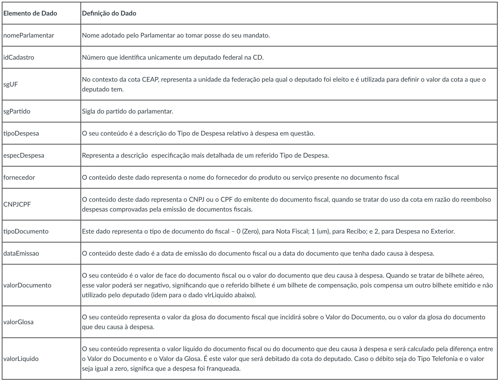

```{r}
library(readr)
library(tidyverse)
options(scipen = 999)
```
 
## Descrição do Problema
Analise realisada para a disciplina de Ciência de dados Predativa (Periodo: 2018.2) e tem como principal objetivo responder determinadas perguntas sobre o conjunto de dados referentes a gastos de deputados relacionados a atividade parlamentar utilizando o CEAP(cota para o exercício da atividade parlamentar).

**Ceap:**  É uma cota única mensal destinada a custear os gastos dos deputados exclusivamente vinculados ao exercício da atividade parlamentar. Exemplos de despesa desse tipo são: passagens aéreas, telefonia, serviços postais, manutenção de escritórios de apoio à atividade parlamentar, assinatura de publicações, fornecimento de alimentação ao parlamentar, hospedagem, outras despesas com locomoção, contemplando locação ou fretamento de aeronaves, veículos automotores e embarcações, serviços de táxi, pedágio e estacionamento e passagens terrestres.

### Perguntas a ser respondidas na analise:
1. Quais são os deputados que gastaram mais dinheiro da CEAP? Quais são os mais econômicos?
2. Quais os estados cujos deputados gastam mais no exterior? Quais os estados cujos deputados gastam menos no exterior?
3. Quais os partidos cujos parlamentares mais usam CEAP no estado da Paraíba? Quais são os que menos usam? Mesmas perguntas considerando valores em R$
4. Quais os deputados que mais ultrapassam o limite de CEAP do seu estado? 
5. Quais estados cujos parlamentares gastam mais com passagens aéreas?
6. Escolha três partidos e responda: Quais são os tipos de despesa mais utilizados no uso da CEAP pelos deputados desses partidos? Mesma pergunta considerando valores em R$.

### Descrição dos dados
 Os dados foram coletados do site de transparência da Câmara e foram tratados.Também foi considerado um conjunto de dados contendo o limite do CEAP por estado.
```{r}
date <- read_csv("date/dadosCEAP.csv")
date$valorGlosa <- as.numeric(sub(",", ".", date$valorGlosa, fixed = TRUE)) 
limiteCeap <- read_csv("date/limiteMensalCEAP.csv")

date %>%
  full_join(limiteCeap, by = c("sgUF" = "UF")) -> date
```

Uma descrição sobre as colunas dos dados se encontra abaixo:



## Quais são os deputados que gastaram mais dinheiro da CEAP? Quais são os mais econômicos?
Para responder essa pergunta iremos separar em dois grupos considerando os que mais gastaram e o que menos gastaram e assim gerar um Top 3 respectivamente de cada grupo.

```{r}
gastadores <- date %>%
              group_by(nomeParlamentar) %>%
              summarise(total = sum(valorLíquido)) %>%
              arrange(-total) %>%
              slice(1:3)

economistas <- date %>%
              group_by(nomeParlamentar) %>%
              summarise(total = sum(valorLíquido)) %>%
              filter(total >= 0) %>%
              arrange(total) %>%
              slice(1:3)
  
parlamentares <- union(gastadores,economistas)

parlamentares %>% ggplot(aes(x =  reorder(nomeParlamentar,total), y = total, ymax = total, ymin = 0)) + 
   geom_point(size = 2) + 
    geom_linerange(size = .3) +
   coord_flip()

```

Como podemos observar 

## Quais os estados cujos deputados gastam mais no exterior? Quais os estados cujos deputados gastam menos no exterior?

```{r}
viajados <- date %>%
            filter(tipoDocumento == 2) %>%
            group_by(nomeParlamentar) %>%
              summarise(total = sum(valorLíquido)) %>%
              arrange(-total) %>%
              slice(1:3)

naoviaja <- date %>%
            filter(tipoDocumento == 2) %>%
            group_by(nomeParlamentar) %>%
              summarise(total = sum(valorLíquido)) %>%
              arrange(total) %>%
              slice(1:3)

parlamentares <- union(viajados,naoviaja)

parlamentares %>% ggplot(aes(x =  reorder(nomeParlamentar,total), y = total, ymax = total, ymin = 0)) + 
   geom_point(size = 2) + 
    geom_linerange(size = .3) +
   coord_flip()
```

## Quais os partidos cujos parlamentares mais usam CEAP no estado da Paraíba? Quais são os que menos usam? Mesmas perguntas considerando valores em R$. 

```{r}
partidosgastadores <- date %>%
                      filter(sgUF == "PB") %>%
                      group_by(sgPartido) %>%
                      summarise(total = sum(valorLíquido)) %>%
                      arrange(-total)

partidosgastadores %>% ggplot(aes(x =  reorder(sgPartido,total), y = total, ymax = total, ymin = 0)) + 
   geom_point(size = 2) + 
    geom_linerange(size = .3) +
   coord_flip() 
```


## Quais os deputados que mais ultrapassam o limite de CEAP do seu estado?
Para isso iremos vericar quais candidatos ultrapassaram o total que refere-se a soma dos valores liquidos referente-se a gastos de cada canditado e comparar com o [limite do CEAP](http://www2.camara.leg.br/comunicacao/assessoria-de-imprensa/cota-parlamentar) referente ao seu estado.

```{r}
date %>% 
    group_by(nomeParlamentar,limite_mensal) %>%
    summarise(total = sum(valorLíquido)) %>%
    filter(total > limite_mensal) %>%
    ungroup() %>%
    arrange(-total) %>%
    slice(1:5) %>%
    ggplot(aes(x = reorder(nomeParlamentar,total), y = total,ymax = total, ymin = 0)) + 
   geom_point(size = 2) + 
    geom_linerange(size = .3) +
   coord_flip() 


```


## Quais estados cujos parlamentares gastam mais com passagens aéreas?

```{r}
estadosviajados <- date %>% filter(tipoDespesa == "PASSAGENS AÉREAS") %>% 
                   group_by(sgUF) %>%
                    summarise(total = sum(valorLíquido)) %>% na.omit() 
        
estadosviajados %>% ggplot(aes(x =  reorder(sgUF,total), y = total, ymax = total, ymin = 0)) + 
   geom_point(size = 2) + 
    geom_linerange(size = .3) +
  scale_size_date() +
   coord_flip()

```

## Escolha três partidos e responda: Quais são os tipos de despesa mais utilizados no uso da CEAP pelos deputados desses partidos? Mesma pergunta considerando valores em R$

```{r}
partidos <- date %>% filter(sgPartido %in% c("PT","PSDB","PMDB")) 

despesasCeap <- partidos %>% group_by(tipoDespesa) %>% summarise(count = n())

despesasCeap %>% ggplot(aes(x =  reorder(tipoDespesa,count), y = count, ymax = count, ymin = 0)) + 
   geom_point(size = 2) + 
    geom_linerange(size = .3) +
   coord_flip()
```

### Despesas CEAP em real.

```{r}
despesasReais <- partidos %>% group_by(tipoDespesa) %>% summarise(total = sum(valorLíquido))

despesasReais %>% ggplot(aes(x =  reorder(tipoDespesa,total), y = total, ymax = total, ymin = 0)) + 
   geom_point(size = 2) + 
    geom_linerange(size = .3) + 
   coord_flip()

```

